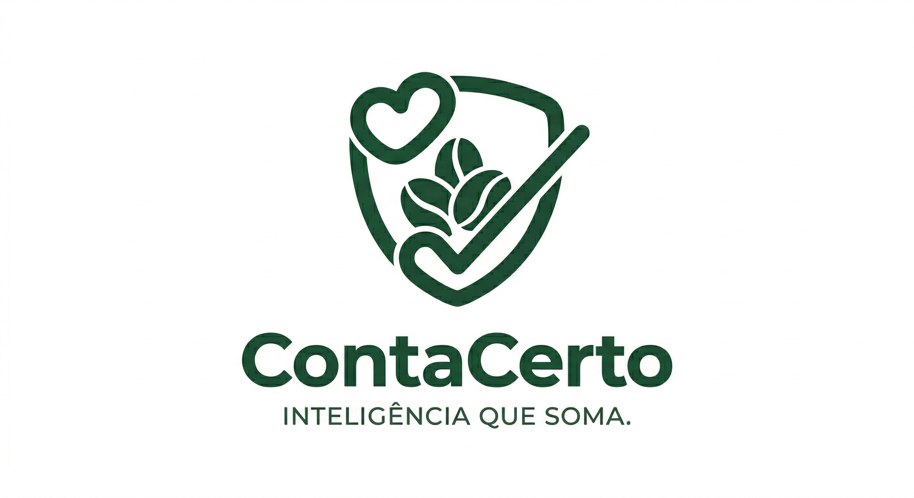

# 🏫 FECAP - Fundação de Comércio Álvares Penteado

<p align="center">
<a href= "https://www.fecap.br/"></a>
</p>

# Projeto 8: ContaCerto ✅🌱

## Nome do Grupo: Radonix

## Integrantes: <a href="https://www.linkedin.com/in/gabrielcarvalhomota/">Gabriel Carvalho</a>, <a href="https://www.linkedin.com/in/sik4s/">Guilherme Siqueira</a>, <a href="https://www.linkedin.com/in/rluizreis/">Rodrigo Reis</a>, <a href="https://www.linkedin.com/in/vitória-maciel-8308a42a6/">Vitória Leticia Maciel</a>.

## Professores Orientadores: <a href="https://www.linkedin.com/in/marcosminorunakatsugawa/">Marcos Minoru</a>, <a href="https://www.linkedin.com/in/rafael-diogo-rossetti/">Rafael Rossetti</a>, <a href="https://www.linkedin.com/in/professorrodnil/">Rodnil Lisbôa</a>, <a href="https://www.linkedin.com/in/rodrigo-da-rosa-phd/">Rodrigo da Rosa</a>, <a href="https://www.linkedin.com/in/victorbarq/">Victor Rosetti</a>.

## 💰 Descrição - ContaCerto


<p align="center">
  Project by <a>Gabriel Carvalho, Guilherme Siqueira, Rodrigo Reis, Vitória Maciel</a>
</p>

O **ContaCerto** (apelidado carinhosamente de CC) nasceu para transformar o trabalho manual e cansativo de conferir doações em um processo leve, inteligente e transparente. Através de um site simples e intuitivo, usamos a Visão Computacional para "dar olhos" à solidariedade: uma câmera identifica automaticamente se o pacote é arroz, feijão ou outro alimento, garantindo que cada item seja registrado com precisão absoluta. É a tecnologia saindo das linhas de código para resolver um problema real do projeto **Lideranças Empáticas**, permitindo que os voluntários foquem menos em planilhas e mais em quem realmente precisa de ajuda.

Nossa plataforma não apenas conta pacotes, ela valoriza o esforço de cada equipe, organizando as arrecadações por grupo e categoria de forma automática e segura. Com o **ContaCerto**, cada doação gera um registro confiável e auditável, trazendo clareza para todo o processo de impacto social dentro da FECAP. É ciência da computação aplicada com um único propósito: usar a inteligência artificial para somar forças e multiplicar o bem.
<br><br>

## 🚀 Ferramentas e Funcionalidades


✨ <b>Principais Funcionalidades</b>  
- **Identificação Inteligente (IA):** Sistema que reconhece e classifica automaticamente pacotes de arroz, feijão e outros tipos de alimentos via câmera.
- **Contagem de Precisão:** Tecnologia de rastreio que garante que cada doação seja contada apenas uma única vez ao passar pela rampa.
- **Site de Operação:** Interface web para os administradores da Lideranças Empáticas selecionarem os nomes das equipes, iniciarem sessões e acompanharem a contagem em tempo real.
- **Registro de Evidências:** Captura e armazenamento automático de fotos de cada item processado para auditoria e segurança dos dados.
- **Relatórios em Nuvem:** Painel que organiza os resultados por equipe, categoria e data, facilitando a gestão para a coordenação do projeto. 

## 🎨 Figma
https://www.figma.com/design/XwCW0RoK16cSd28sLVHa7K/Figma-PI5-?node-id=0-1&p=f&t=zjPLYhTzqw6b2N22-0
<br><br>

## 🛠 Estrutura de pastas

```
├── documentos/
│   ├── Entrega1/
│   │   ├── Álgebra Linear, Vetores e Geometria Analítica/
│   │   ├── Sistemas Operacionais e Computação em Nuvem/
│   │   ├── Projeto_Interdisciplinar: Inteligência Artificial/
│   │   ├── Psicologia, Liderança e Soft Skills/
│   │   └── Inteligência Artifical e Aprendizado de Máquina/
│   ├── Entrega2/
│   │   ├── Álgebra Linear, Vetores e Geometria Analítica/
│   │   ├── Sistemas Operacionais e Computação em Nuvem/
│   │   ├── Projeto_Interdisciplinar: Inteligência Artificial/
│   │   ├── Psicologia, Liderança e Soft Skills/
│   │   └── Inteligência Artifical e Aprendizado de Máquina/
│   ├── Documentação.docx
├── imagens/
├── src/
│   ├── Entrega1/
│   ├── Entrega2/
└── readme.md<br>
```

<b>📄 README.MD</b>: Arquivo que serve como guia e explicação geral sobre o projeto.

Há também 4 pastas que seguem da seguinte forma:

<b>🗂️ Documentos</b>: Toda a documentação geral do projeto. Além das entregas das disciplinas do semestre.

<b>📷 imagens</b>: Imagens utilizadas para documentação e explicação do projeto.

<b>🧑‍💻 src</b>: Pasta que contém o código fonte (frontend e backend).

## 📋 Licença/License
PicMoney © 2025 by Gabriel Carvalho, Guilherme Siqueira, Rodrigo Luiz, Vitória Maciel is licensed under CC BY 4.0
